<p align="center">
  
</p>

<h1 align="center">Siri AI+</h1>

<p align="center">
  <b>The Siri AI that Apple should have shipped.</b><br>
  An AI assistant for the Mac built on Apple Intelligence, wired into your Apple apps, local first and privacy safe.<br>
  <sub>A hobby project, made in Italy 🇮🇹 on a Sunday and a few evenings.</sub>
</p>

<p align="center">
  <a href="https://github.com/ivanmosetti07/siri-ai-plus/releases/latest"></a>
  
  
  
  <a href="LICENSE.md"></a>
  <a href="https://github.com/ivanmosetti07/siri-ai-plus/stargazers"></a>
</p>

<p align="center">
  <a href="https://github.com/ivanmosetti07/siri-ai-plus/releases/latest"><b>⬇️ Download</b></a> ·
  <a href="#-english">English</a> ·
  <a href="#-italiano">Italiano</a> ·
  <a href="https://github.com/ivanmosetti07/siri-ai-plus/issues/new">🐛 Report a bug</a> ·
  <a href="https://github.com/ivanmosetti07/siri-ai-plus/discussions">💬 Discussions</a>
</p>

<p align="center">
  ⭐ <b>If you like it, leave a star!</b> It's free and helps other people find it.<br>
  ⭐ <b>Se ti piace, lascia una stella!</b> È gratis e aiuta altre persone a trovarlo.
</p>

<p align="center">
  <a href="https://www.paypal.com/cgi-bin/webscr?cmd=_donations&amp;business=ivanmosetti%40gmail.com&amp;item_name=Support%20Siri%20AI%2B%20and%20future%20open-source%20apps&amp;currency_code=EUR"></a><br>
  <sub>Help me build more open-source apps · Aiutami a realizzare altre app open source</sub>
</p>

<p align="center">
  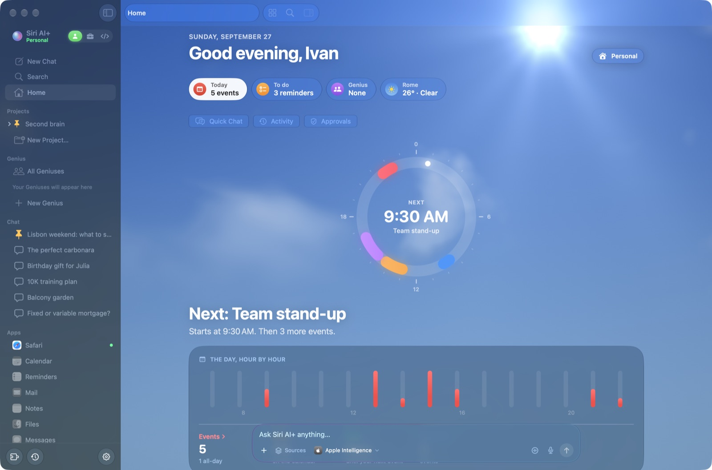
</p>

> [!NOTE]
> Siri AI+ is an independent hobby project. It is not affiliated with, endorsed by, or sponsored by Apple Inc. Siri, Apple Intelligence, Xcode, Safari, Pages, Numbers and Keynote are trademarks of Apple Inc.
>
> 🙏 *Dear Apple, please don't sue me. Copy it, buy it… nah, just don't sue me: I only made it for fun. I'm just a pirate, a little hungry and a little foolish 🏴‍☠️😅*<br>
> 🙏 *Ti prego Apple, non denunciarmi. Copiala, comprala… na, non denunciarmi: l'ho fatta solo per gioco. Sono solo un pirata, un po' affamato e un po' folle ahahah 🏴‍☠️😅*

---

## 🇬🇧 English

### What is this?

Picture the Siri we've all been waiting for. It actually reads your calendar, answers your email, keeps your notes tidy, works inside your project folders, builds apps with Xcode, and chats like the best desktop AI apps. That's Siri AI+. 🪄

The goal: publish the Siri AI that Apple should have launched. It's fully integrated with the Apple apps, Xcode included, and has the basic features you expect from the best AI apps like Claude or ChatGPT Desktop. Above all, it **brings AI to everyone** with local AI, on the Mac you already own.

It runs on **Apple Intelligence**, right on your Mac by default: no account or subscription, and requests stay on the Mac. When Apple's small on-device model isn't enough, you can plug in bigger brains. Local ones like Gemma 4 and ds4 stay on your Mac. A one-time ChatGPT or Claude request from Quick Chat shows the source text proposed for sending and asks for confirmation.

> [!TIP]
> 🌍 **Speaks English and Italian.** The interface follows your Mac's language: Italian on a Mac set to Italian, English everywhere else. The assistant answers in the language of each request, so you can switch between English and Italian in the same chat.

### 🇮🇹 Why I made it

Some Italians are showing that AI can run on everyone's computer. Salvatore Sanfilippo ([@antirez](https://github.com/antirez)) does it with [ds4](https://github.com/antirez/ds4), which runs huge models on your own machine. Simone Rizzo ([@simone-rizzo](https://github.com/simone-rizzo)) does it with [rizzo-pii](https://github.com/Rizzo-AI-Academy/rizzo-pii), which anonymizes your data before it reaches the big AI models. I want to be part of that (unofficial) team of Italians too: people doing something to bring AI to everyone's computer, for free wherever possible.

I'm convinced that 70% of people can already do most of their everyday tasks with Apple Intelligence, or with Gemma with reasoning turned on. Once Private Cloud Compute arrives, even more. With Gemma I even managed to build a Snake game 🐍

### What it can do

- 🌍 **English and Italian.** The whole interface is translated, and the assistant replies in the language you write in. Dates, numbers, commands for your apps, documents, sheets, slides and coding work in both.
- 💬 **Chat like the big ones.**
  - Chats, projects, side-by-side chats (up to 4) and child chats.
  - ⌘K search, voice mode and dictation.
  - File and image attachments, and web search with numbered sources.
  - Memory, skills, and a "How I worked" trace under every answer.
- ⚡ **Use it from any screen.** The menu bar and global ⌥⌘K open Quick Chat, with one persistent conversation for Personal and one for Work. Global ⌥⌘V starts voice mode.
  - Quick Chat reads selected text only from apps you explicitly allow. It shows the source and text, lets you remove it, and captures a screen or window only when you choose to.
  - Replacing selected text requires a preview and confirmation. If the app cannot safely accept the edit, Siri AI+ gives you text to copy.
- 🍎 **Your Apple apps, inside the chat.**
  - Calendar, Reminders, Mail, Notes, Messages, Contacts, Voice Memos, Files and a built-in Safari.
  - They open as tabs next to the chat, and every chat keeps its own open apps.
  - Say "move tomorrow's meeting to 4 pm" or "reply to Mario that Thursday works" and you get a card to confirm. **Nothing is written or sent without your OK**, and you can undo for 10 minutes.
- 📄 **Documents, sheets and slides.** Editors in the style of Pages, Numbers and Keynote that the AI can write and change ("add a slide on next steps", "make a pie chart").
- 📁 **Projects.**
  - Link a folder and the chat uses it as context: AGENTS.md or CLAUDE.md, file maps, daily logs.
  - An Obsidian-style graph shows your notes as a brain.
  - In the Personal space a project needs no folder: just a name. It keeps its own chats and memory, and collects the attachments, documents and images from its chats.
- 🛠️ **Coding space, Xcode included.**
  - Create websites, web apps and SwiftUI apps for Mac and iPhone with any model.
  - Live preview in the session's own Safari, showing console errors, with a "Fix" button.
  - Restore points, a diff review, and "Open in Xcode" for native apps.
- 🤖 **Genius.**
  - Create a Genius through a step-by-step chat: describe its task and expected result, choose access, schedule, model, role and name, then review it before creation. Find each Genius in the sidebar alongside Projects, with a persistent chat on the right.
  - Pick a model for each Genius during creation and override it for any individual schedule. Existing schedules can keep using the Genius model.
  - The six suggested Geniuses come with distinct, native Apple Genmoji made in Image Playground; you can make a personal Genmoji for any Genius.
  - Create a personal Genmoji with Apple's Image Playground. Its role icon stays visible behind the Genmoji in the sidebar, chat and activity views; the icon can be selected or inferred from the Genius's work.
  - Create private skills for each Genius, or copy an existing skill into its Skill tab. They guide its chat and scheduled runs when the task matches.
  - They plan, use sub-agents, ask before important actions and keep a run history.
  - At night they "dream" to learn from their mistakes.
- ⬇️ **In-app updates.** When you're online, Siri AI+ checks GitHub for a newer release at launch and every few hours. If there is one, a download icon appears at the bottom of the sidebar: one click downloads it, checks its signature and restarts the app. You can also use **Siri AI+ › Check for Updates…**
- 🧩 **MCP connectors.** Local or remote servers (with OAuth login), which you can import from Claude Desktop.
  - Tools that only read run on their own, like reading your calendar; anything that creates, changes or sends shows a card for you to confirm.
  - The chat picks the right service even when you don't name it ("which clients are paused?"), chains the calls that catalog-style services need, and turns their JSON into something the model can read.
- 🧠 **A harness built for small models.**
  - A sub-agent picks the right tools for every request.
  - Complex tasks become plans that sub-agents run in parallel.
  - Sub-agents compact long conversations.
  - Code, not the model, does exact math (dates, times, totals).

### 📸 A quick tour

<table>
  <tr>
    <td width="50%">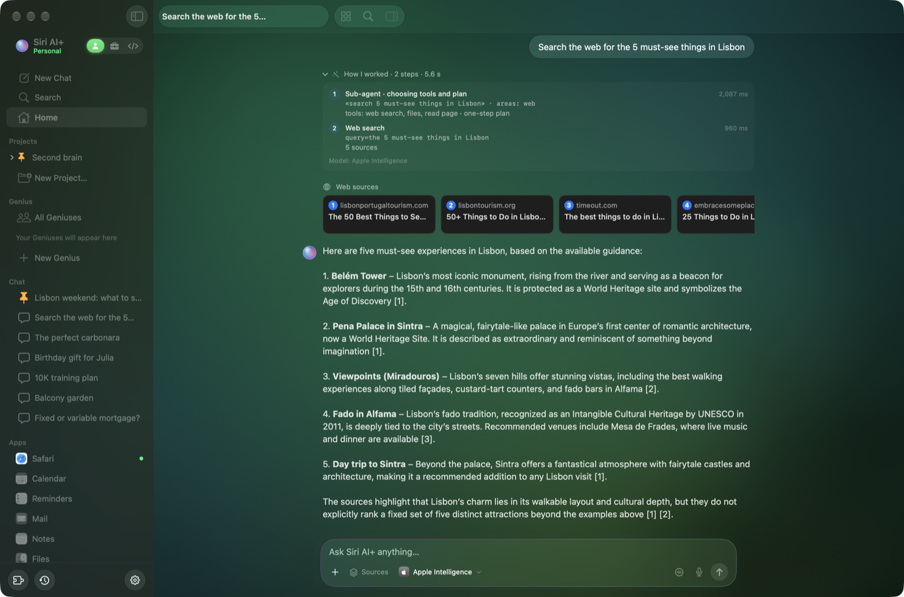<br><sub><b>Web search</b> with numbered sources and the "How I worked" trace</sub></td>
    <td width="50%">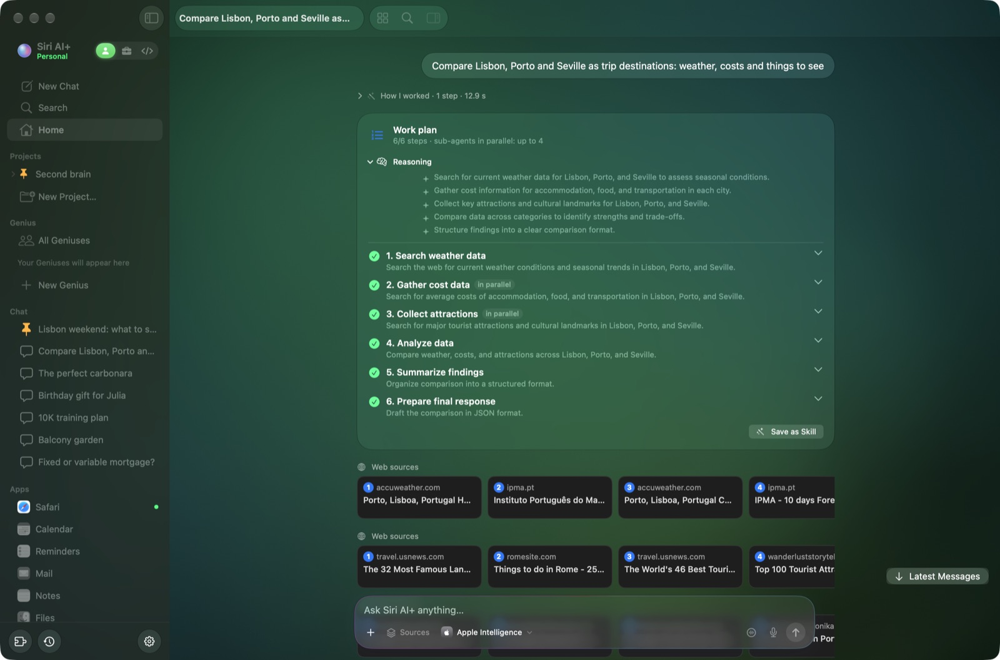<br><sub><b>Plans with sub-agents:</b> complex tasks split into steps that run in parallel</sub></td>
  </tr>
  <tr>
    <td>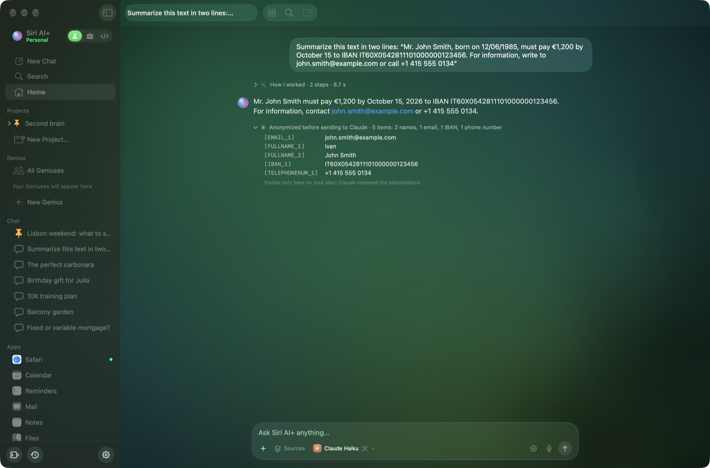<br><sub><b>Privacy shield:</b> Claude only gets placeholders, you read the real data</sub></td>
    <td>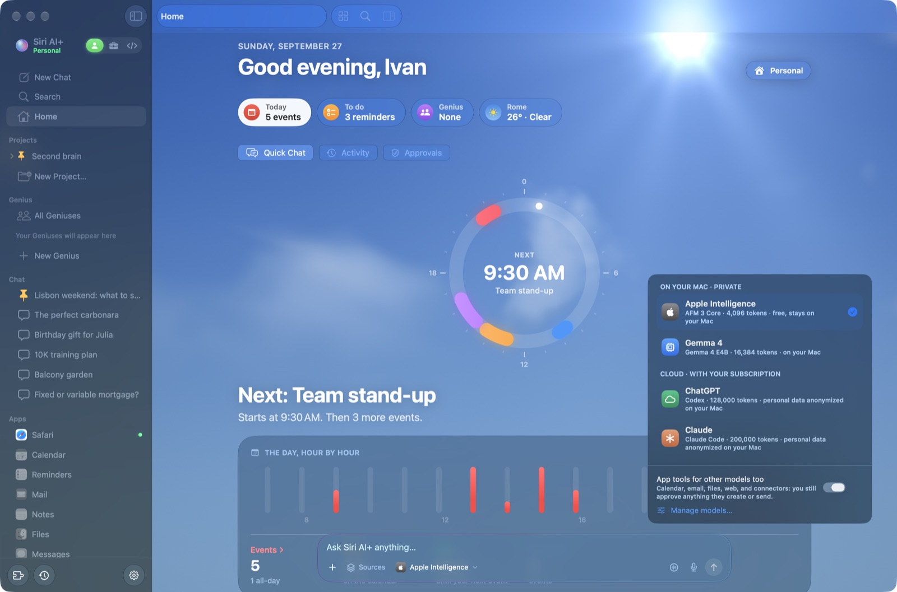<br><sub><b>Pick a model</b> for each chat, on your Mac or in the cloud</sub></td>
  </tr>
  <tr>
    <td>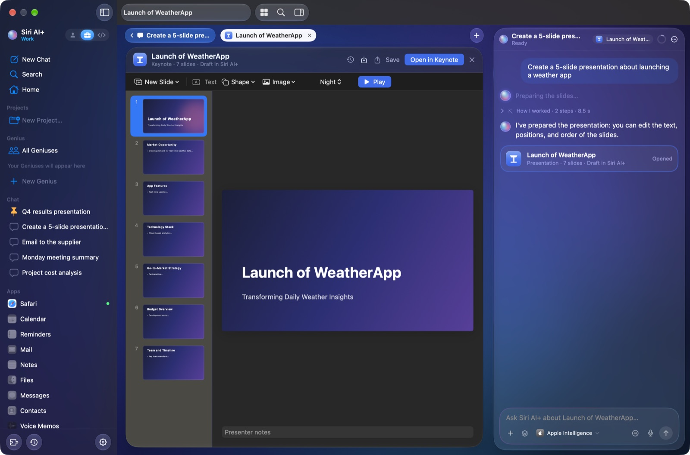<br><sub><b>Presentations</b> written by Apple Intelligence, ready to edit</sub></td>
    <td>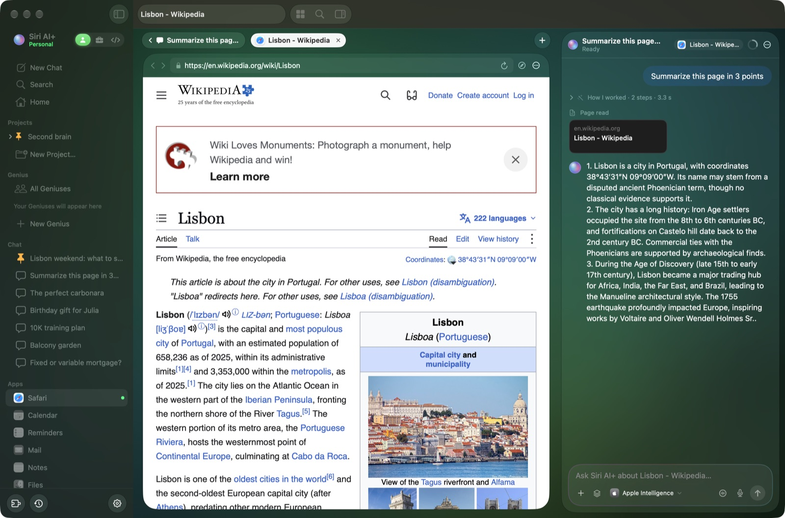<br><sub><b>Apps in tabs:</b> Safari next to the chat, which reads the page for you</sub></td>
  </tr>
  <tr>
    <td>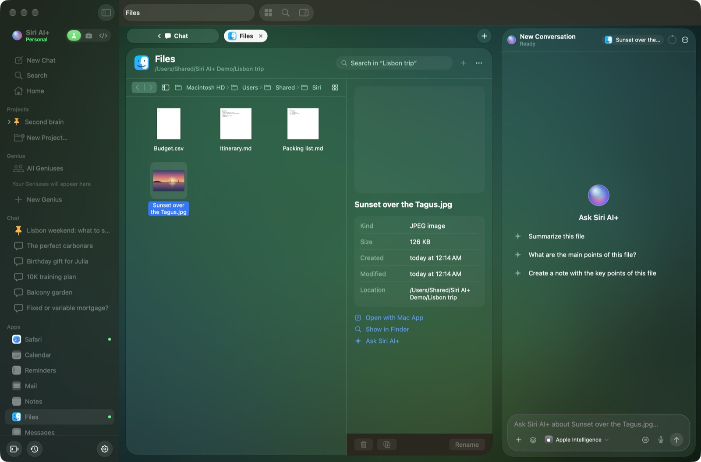<br><sub><b>Files</b> with thumbnails, and the chat knows what you selected</sub></td>
    <td>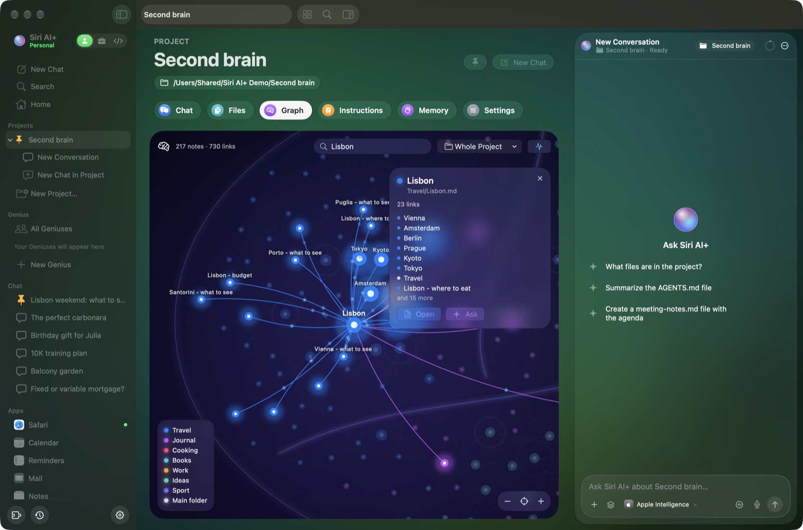<br><sub><b>Projects:</b> your notes as a brain, Obsidian style</sub></td>
  </tr>
  <tr>
    <td>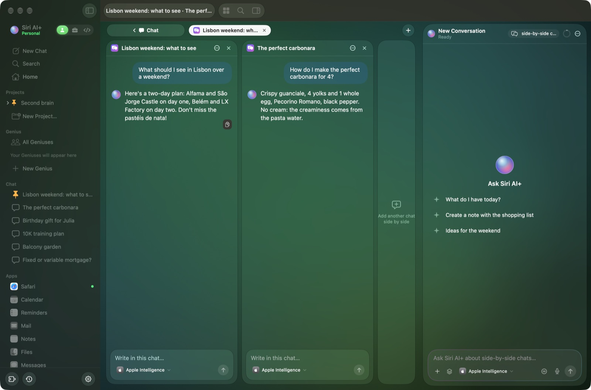<br><sub><b>Side-by-side chats</b>, each with its own model</sub></td>
    <td><br><sub><b>Geniuses</b> work on a schedule, keep a run history and ask before acting</sub></td>
  </tr>
  <tr>
    <td>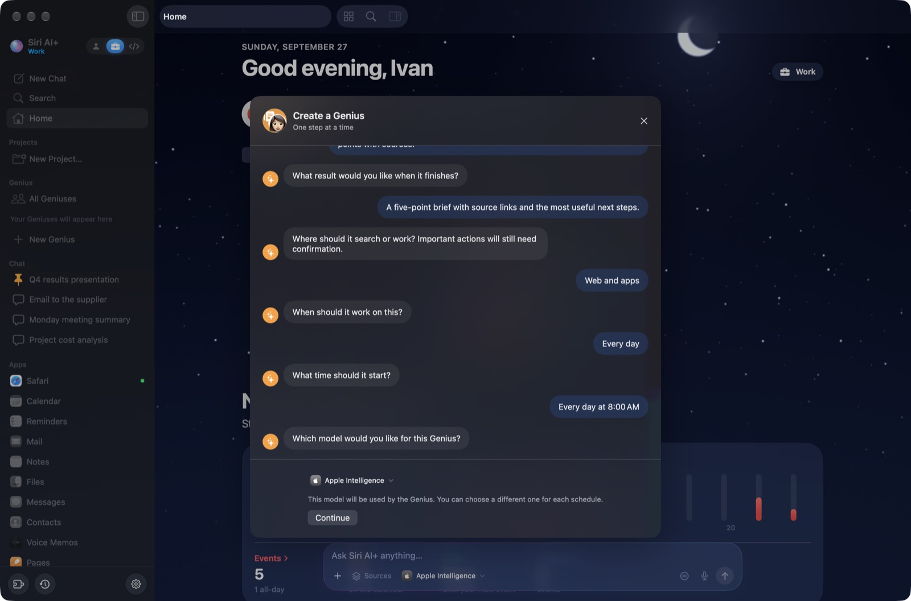<br><sub><b>Create a Genius through chat:</b> task, result, access, schedule and model, one step at a time</sub></td>
    <td>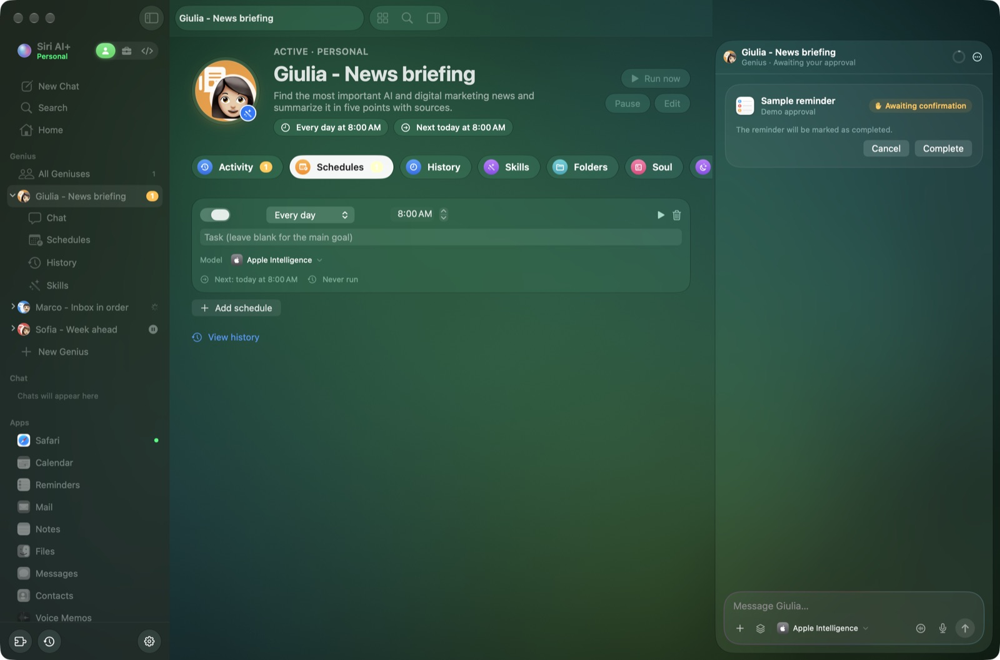<br><sub><b>Schedules:</b> each one can use its own model</sub></td>
  </tr>
  <tr>
    <td colspan="2">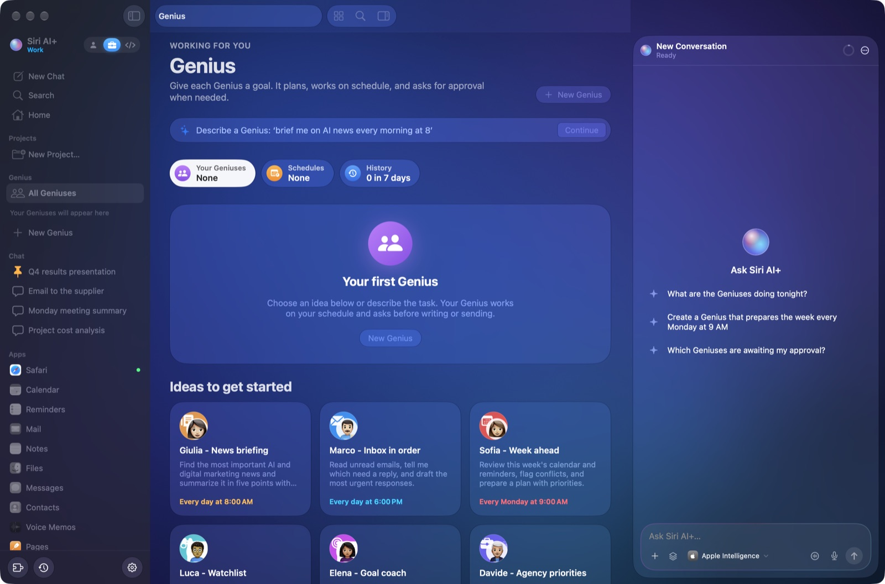<br><sub><b>Six Genius ideas</b>, each with its own Apple Genmoji made in Image Playground</sub></td>
  </tr>
  <tr>
    <td>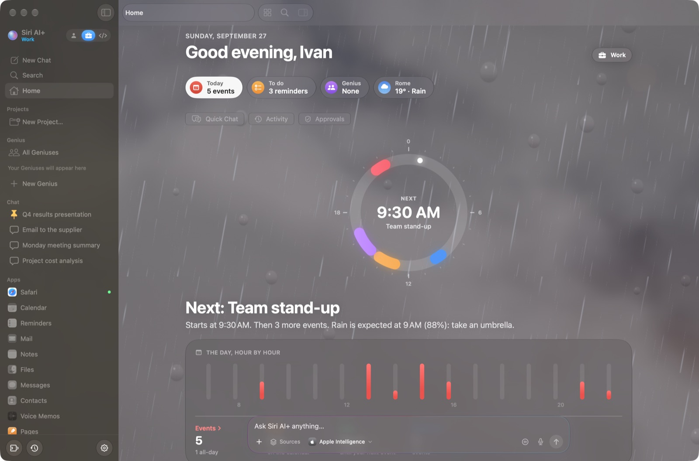<br><sub><b>Spaces:</b> Personal, Work and Coding, each with its own look (here Work, in the rain)</sub></td>
    <td>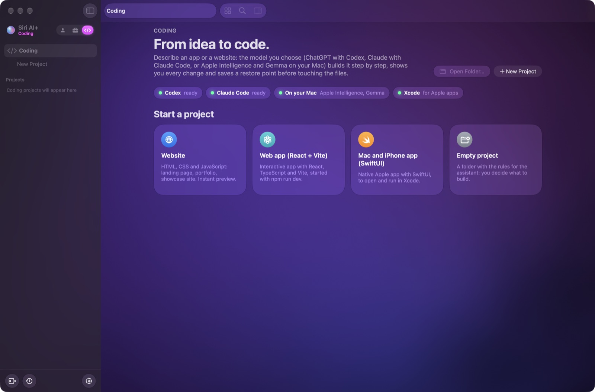<br><sub><b>Coding space:</b> websites, web apps and SwiftUI apps with Xcode</sub></td>
  </tr>
</table>

<sub>The screenshots use a demo profile: chats, notes, files and appointments are all made up. The [Italian section](#-italiano) shows the same screens in Italian.</sub>

### The models

| Model | Where it runs | Privacy | Notes |
|---|---|---|---|
| **Apple Intelligence** | On your Mac | 🔒 Nothing leaves the Mac | The default, free. Small model (about 4K tokens of context on my M2 Pro), so Siri AI+ squeezes every drop out of it |
| **Gemma 4** | On your Mac (llama.cpp) | 🔒 Nothing leaves the Mac | Pick the size for your memory: E2B (any Mac), E4B (12 GB+), 12B (16 GB+), 26B A4B (32 GB+), 31B (48 GB+) |
| **ds4** by [@antirez](https://github.com/antirez) | On your Mac | 🔒 Nothing leaves the Mac | Very powerful models (DeepSeek V4 Flash) on high-end hardware: 96 GB or more of unified memory |
| **ChatGPT** | OpenAI cloud, with your subscription (Codex CLI) | 🛡️ Personal data anonymized first | Pick version and reasoning for each chat |
| **Claude** | Anthropic cloud, with your subscription (Claude Code CLI) | 🛡️ Personal data anonymized first | Pick version and reasoning for each chat |
| **Auto** ✨ | Picks for every request | 🔒/🛡️ Like the model it picks | Apple Intelligence for simple things, Gemma for private, medium or long ones, ChatGPT (or Claude) for hard reasoning and code. The reason for each choice is in «How I worked» |

Every chat remembers its model. Whatever model answers, the tools for each request are picked on your Mac, for free: first by rizzo-flow (below), then by Apple Intelligence when rizzo-flow isn't sure.

**The same 30 tasks for every model.** To check that each model uses the right tool or connector at the right moment (and none when it isn't needed), Siri AI+ has a bench that gives every model the same 30 made-up requests: calendar, reminders, mail, messages, notes, files, the web, two fake connectors, even an email with hidden instructions for the assistant. It only uses invented data (a fake «Mario Rossi»), never your calendar or your mail: `./bin/siriai --banco-strumenti --provider apple|gemma|chatgpt|claude|auto`. Before and after the fixes of September 28, 2026:

| Model | Before | After |
|---|---|---|
| Apple Intelligence | 26/30 | 30/30 |
| Auto | 25/30 | 30/30 |
| ChatGPT (GPT-6-Luna, low reasoning) | 25/30 | 29/30 |
| Claude (Sonnet, low reasoning) | 27/30 | 29/30 |

Gemma 4 isn't in the table yet: that day my 16 GB Mac didn't have the memory to run it next to Apple Intelligence.

### ⚡ Fast decisions, thanks to rizzo-flow

Most of what an assistant decides before answering is a closed question: which app should I look in? Which action? Which model? Does this file contain personal data? Is this worth remembering? Siri AI+ used to ask a small generative model, one question at a time. Now it asks [rizzo-flow](https://github.com/rizzo-ai-academy/rizzo-flow), the open source *System One* by Simone Rizzo ([@simone-rizzo](https://github.com/simone-rizzo)) and Rizzo AI Academy: a local model that doesn't write a single word, it just reads the probability of each answer. It takes a few tenths of a second, and when it isn't sure, Siri AI+ decides as before.

- **Faster answers.** It picks the area and the action on its own, so Apple Intelligence's planner is skipped when there's nothing to fill in. On my benchmarks the median time went from 3.9 to 2.4 s for planning, from 6.8 to 4.4 s for everyday questions and from 8.5 to 6.5 s for connectors, with the same scores.
- **Auto model.** Two closed questions (how hard, how private) pick the model for every request.
- **Memory that thinks.** It saves only lasting facts (no more false alarms on «I like this answer»), spots duplicates and updates old facts. You see «Remembered: …» with Undo.
- **Anonymization only where it's needed.** On long texts it tells code and manuals from documents with people in them, and skips rizzo-pii only when it's sure (emails, phone numbers, IBANs and names already hidden stay hidden anyway).
- **Optional.** It's a 2.6 GB download (Settings › Models), it runs with llama.cpp on your Mac, and it frees the memory after 15 minutes without requests.

#### 🙏 A note on ds4

Confession: my computer isn't powerful enough for [ds4](https://github.com/antirez/ds4), so I've never been able to test it inside Siri AI+. If you try it, please let me know how it goes (an issue is perfect). Maybe even you, Salvatore ([@antirez](https://github.com/antirez))… *famme sape'!* 😄

### 🛡️ The privacy shield, thanks to rizzo-pii

Claude and ChatGPT are great, but your text ends up on someone else's servers, so privacy isn't guaranteed. Apple would never approve 😅. That's why Siri AI+ has a privacy shield. It's built on [rizzo-pii](https://github.com/Rizzo-AI-Academy/rizzo-pii), the open source anonymizer by Simone Rizzo ([@simone-rizzo](https://github.com/simone-rizzo)) and Rizzo AI Academy.

Whenever personal data is detected, the Mac swaps it for a placeholder before the text goes to Claude or ChatGPT. When the answer comes back, the real data is put back in. A real run:

```text
You write:        Write to John Smith (john.smith@example.com) that the €1,200 invoice is due on October 15, IBAN IT60X0542811101000000123456
What leaves:      Write to [FULLNAME_1] ([EMAIL_1]) that the €1,200 invoice is due on October 15, IBAN [IBAN_1]
What you read:    the answer, with the real name, email and IBAN put back on your Mac
```

- **Hidden:** names, emails, phone numbers, tax and VAT codes, ID documents, IBANs, cards, home addresses, license plates, land registry data and public IP addresses.
- **Kept readable:** amounts, dates, times, cities, companies and websites. Without them the AI couldn't do its job. You can hide them too in Settings.
- **Everything is covered:** your messages, chat history, memory, project instructions, files, email and tool results.
- **The dictionary stays on your Mac.** If the anonymizer isn't installed or fails, **nothing is sent** and Apple Intelligence answers instead.
- **It runs locally with Core ML.** The rizzo-pii model is converted to Core ML and its rules are rewritten in Swift, with the same results as the original. It takes about 40 ms for every 120 words.
- **Not covered yet:** the coding space, where Codex and Claude Code read your project files directly.

### 🇪🇺 Why Europe, and why it matters

In June 2026 Apple announced that [the new Siri AI won't ship in the EU on iPhone, iPad and Apple Watch](https://www.apple.com/newsroom/2026/06/due-to-dma-siri-ai-delayed-in-eu-for-ios-27-and-ipados-27/) because of the **Digital Markets Act (DMA)**.

- **What the DMA asks:** Apple is a "gatekeeper", so it must open its platform to other services.
- **Apple's reading:** it would have to give any third-party assistant the same deep access to your messages, data and apps that Siri AI has, and Apple sees that as a privacy and security risk.
- **Apple's proposal:** a middle layer called a "Trusted System Agent". The European Commission said no, and [replied](https://www.euronews.com/next/2026/06/11/the-eus-dma-fines-delayed-features-and-unclear-benefits) that "absolutely nothing in the DMA prohibits Apple from introducing new products in the EU".
- **The result:** there is no date for iPhone and iPad. On the Mac, Siri AI is available in the EU.

Apps like this one get Apple's small on-device model. Apple's bigger model on Private Cloud Compute needs a managed entitlement from Apple. The on-device model remains the default; when Apple grants access, you can opt in from Settings, subject to availability and quota.

My two cents: Siri AI+ is open to other models, both local and cloud. Personal data is anonymized on the Mac before it leaves, and nothing happens without your confirmation. Maybe this is how openness and privacy can live together, and how Apple could land in Europe without any drama. Apple, call me 😄

### ⬇️ Download and install

**Requirements:**
- a Mac with Apple silicon;
- **macOS 27**;
- Apple Intelligence turned on (System Settings › Apple Intelligence & Siri).

**Option 1: the ready-made app**

1. Download `Siri-AI-Plus-macOS.zip` from the [latest release](https://github.com/ivanmosetti07/siri-ai-plus/releases/latest).
2. Unzip it and drag **Siri AI+** into **Applications**.
3. The app isn't notarized by Apple, because that takes a paid developer account, so macOS blocks it the first time. Open **System Settings › Privacy & Security**, scroll down and click **Open Anyway**. Or use Terminal:

   ```bash
   xattr -dr com.apple.quarantine "/Applications/Siri AI+.app"
   ```

**Updates.** From version 2.1 on, Siri AI+ tells you when a new release is out: click the download icon at the bottom of the sidebar and it installs the new version and restarts. It only accepts an app signed like the one you have, and macOS may ask for your password if the app is in Applications. On version 2.0, download the new release by hand once.

**Option 2: build it yourself** (needs Xcode 27)

```bash
git clone https://github.com/ivanmosetti07/siri-ai-plus.git
cd siri-ai-plus
./build.sh
cp -R "Siri AI+.app" /Applications/
```

`build.sh` prefers an Apple code signing certificate with a Team ID, which macOS needs to run the actions in Shortcuts. If none is available it uses another signing certificate, or an ad hoc signature as a last resort. Without a stable signature macOS may ask for permissions again after a rebuild; without a Team ID the actions can appear in Shortcuts but fail when run.

### 🚀 How to use it

1. **First launch.** Choose which sources Siri AI+ can use (Calendar, Reminders, Mail, Notes…) and whether it can only read them or also edit. macOS asks for each permission once. Messages and Voice Memos need Full Disk Access, and Mail is much faster with it.
2. **Just ask**, in English or Italian:
   - "What's on tomorrow?"
   - "Remind me to call the accountant on Friday"
   - "Reply to Mario that Thursday works"
   - "Make a presentation about the product launch"
   - "Search the web for the latest Apple news"
3. **Confirm.** Anything that writes, sends or deletes shows up as a card, and you decide.
4. **Shortcuts:**

   | Shortcut | Action |
   |---|---|
   | ⌘N | New chat |
   | ⌘K | Search |
   | ⌥⌘K | Quick Chat from any app |
   | ⌥⌘A | Apps in tabs |
   | ⌥⌘N | Side-by-side chats |
   | ⇧⌘N | Child chat |
   | ⌥⌘V | Voice mode |
   | ⌥⌘S | Show or hide the side chat |

5. **Spaces.** Switch between Personal, Work and Coding next to the name in the sidebar. Each space has its own chats, projects, Geniuses, calendars and model.
6. **Change model** from the model panel in the text field. Every chat keeps its own model, version and reasoning level.

The native Xcode app exposes **Open Siri AI+** and **Ask Siri AI+** as actions in Shortcuts. On macOS, add these actions to your own shortcut; the app does not install a preconfigured App Shortcut. In Settings you can opt in to launching Siri AI+ at login. Closing its window leaves the menu bar companion and scheduled Genius running; **Quit** stops them.

**Optional extras**, in Settings › Models:

- **Gemma 4:** installs llama.cpp with Homebrew and downloads the version recommended for your Mac.
- **ds4:** on Macs with 96 GB or more, it downloads and builds [antirez/ds4](https://github.com/antirez/ds4), then downloads the model.
- **ChatGPT and Claude:** install the official Codex and Claude Code CLIs, then log in with your own subscription in the browser.
- **The privacy shield**, required for ChatGPT and Claude. Run it once from the repository folder. It needs [pipx](https://pipx.pypa.io) (`brew install pipx`) and Xcode:

  ```bash
  Support/rizzo-pii/install.sh
  ```

For developers, the technical guide is in Italian (it also explains how the translations and the updates work): [docs/GUIDA-TECNICA.md](docs/GUIDA-TECNICA.md). It covers the architecture, the test benches and the diagnostic flags. To run the tests: `./test.sh`.

### 🐛 Known issues

I built this on a Sunday and a few evenings, just for fun, so there are bugs. The ones I know about:

- Apple's small on-device model still trips on trick questions and very long texts. The harness helps a lot, but it's a 3-billion-parameter model.
- The release isn't notarized, so macOS complains the first time.
- The privacy shield doesn't cover the coding space.
- ds4 is untested (see above 🙏).

Found something? Open an [issue](https://github.com/ivanmosetti07/siri-ai-plus/issues). Pull requests are welcome.

### ⭐ Support the project

- ⭐ **Star the repo** with the button at the top right. It's free, it motivates me, and it helps other people find Siri AI+.
- 💙 **[Support me on PayPal](https://www.paypal.com/cgi-bin/webscr?cmd=_donations&business=ivanmosetti%40gmail.com&item_name=Support%20Siri%20AI%2B%20and%20future%20open-source%20apps&currency_code=EUR)** to help me create more open-source apps.
- 👀 **Watch › Custom › Releases** to get a notification when a new version comes out.
- 🐛 **Found a bug?** [Open an issue](https://github.com/ivanmosetti07/siri-ai-plus/issues/new).
- 💡 **Got an idea or a question?** Join the [Discussions](https://github.com/ivanmosetti07/siri-ai-plus/discussions).
- 🍴 **Fork it** and experiment, for non-commercial use (see the license). Pull requests are welcome, new languages included!
- 📣 **Share it** on [X](https://twitter.com/intent/tweet?text=Siri%20AI%2B%3A%20the%20Siri%20AI%20Apple%20should%20have%20shipped%20%F0%9F%8D%8E&url=https%3A%2F%2Fgithub.com%2Fivanmosetti07%2Fsiri-ai-plus) or [LinkedIn](https://www.linkedin.com/sharing/share-offsite/?url=https%3A%2F%2Fgithub.com%2Fivanmosetti07%2Fsiri-ai-plus).
- 👤 **Follow me** on GitHub: [@ivanmosetti07](https://github.com/ivanmosetti07).

### 📜 License

The license is [PolyForm Noncommercial 1.0.0](LICENSE.md). You can use, study, change and share Siri AI+ for free, for any **non-commercial** purpose: personal use, study, research, hobbies, schools, non-profits. You **can't** sell it or use it to make money. That makes it *source available* rather than "open source" in the OSI sense. For commercial use, get in touch.

Third-party credits and licenses are in [THIRD_PARTY_NOTICES.md](THIRD_PARTY_NOTICES.md).

### ❤️ Thanks

- Apple, for the Foundation Models framework.
- Salvatore Sanfilippo ([@antirez](https://github.com/antirez)), for [ds4](https://github.com/antirez/ds4).
- Simone Rizzo ([@simone-rizzo](https://github.com/simone-rizzo)) and Rizzo AI Academy, for [rizzo-pii](https://github.com/Rizzo-AI-Academy/rizzo-pii) and [rizzo-flow](https://github.com/rizzo-ai-academy/rizzo-flow).
- Google, for [Gemma](https://ai.google.dev/gemma), and [ggml-org](https://github.com/ggml-org/llama.cpp), for llama.cpp.
- [Open-Meteo](https://open-meteo.com), for the weather data.
- OpenAI Codex and Anthropic Claude Code, for letting your subscription do the heavy lifting.

---

## 🇮🇹 Italiano

<p align="center">
  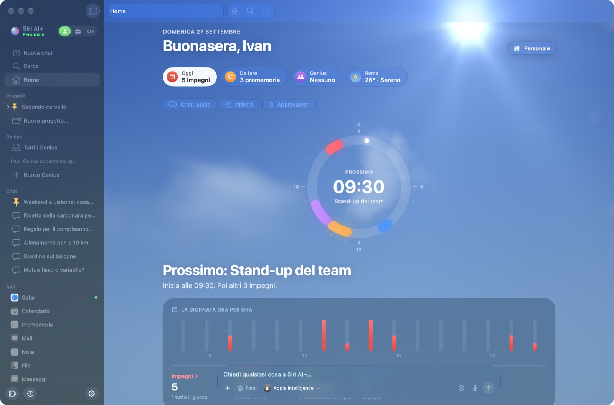
</p>

### Cos'è?

Immagina il Siri che tutti aspettavamo. Legge davvero il tuo calendario, risponde alle email, tiene in ordine le note, lavora nelle cartelle dei tuoi progetti, crea app con Xcode e chatta come le migliori app di AI per desktop. Ecco Siri AI+. 🪄

Lo scopo: pubblicare il Siri AI che Apple avrebbe dovuto lanciare. È completamente integrato con le app Apple, Xcode incluso, e ha le funzioni di base delle migliori app come Claude o ChatGPT Desktop. Soprattutto, **porta l'AI a tutti** con l'AI locale, sul Mac che hai già.

Funziona con **Apple Intelligence**, direttamente sul tuo Mac come scelta iniziale: niente account o abbonamenti, e le richieste restano sul Mac. Quando il modello piccolo di Apple non basta, puoi collegare modelli più grandi. Quelli locali, come Gemma 4 e ds4, restano sul Mac. Per riprovare una richiesta della Chat rapida con Claude o ChatGPT, l'app mostra il testo che uscirebbe dal Mac e chiede conferma.

> [!TIP]
> 🌍 **Parla italiano e inglese.** L'interfaccia segue la lingua del Mac: in italiano sui Mac impostati in italiano, in inglese in tutti gli altri. L'assistente risponde nella lingua di ogni richiesta, quindi nella stessa chat puoi passare dall'italiano all'inglese.

### 🇮🇹 Perché l'ho fatto

Ci sono italiani che stanno dimostrando che l'AI può girare sul computer di tutti. Salvatore Sanfilippo ([@antirez](https://github.com/antirez)) lo fa con [ds4](https://github.com/antirez/ds4), che fa girare modelli enormi sul tuo computer. Simone Rizzo ([@simone-rizzo](https://github.com/simone-rizzo)) lo fa con [rizzo-pii](https://github.com/Rizzo-AI-Academy/rizzo-pii), che anonimizza i tuoi dati prima che arrivino ai grandi modelli di AI. Anch'io voglio far parte di questo team (non ufficiale) di italiani che fa qualcosa per portare l'AI sul computer di tutti, e gratis dove possibile.

Sono convinto che il 70% delle persone possa già fare la maggior parte delle attività di tutti i giorni con Apple Intelligence, o con Gemma con il ragionamento attivo. Quando arriverà Private Cloud Compute, ancora di più. Con Gemma sono riuscito a programmarci persino Snake 🐍

### Cosa sa fare

- 🌍 **Italiano e inglese.** Tutta l'interfaccia è tradotta e l'assistente risponde nella lingua in cui scrivi. Date, numeri, comandi alle app, documenti, fogli, presentazioni e programmazione funzionano in entrambe.
- 💬 **Chatta come le app più famose.**
  - Chat, progetti, chat affiancate (fino a 4) e chat figlie.
  - Ricerca con ⌘K, modalità vocale e dettatura.
  - Allegati di file e immagini, e ricerca sul web con le fonti numerate.
  - Memoria, skill e, sotto ogni risposta, il riquadro «Come ho lavorato».
- ⚡ **Da qualunque schermata.** La barra dei menu e la scorciatoia globale ⌥⌘K aprono la Chat rapida, con una conversazione persistente per Personale e una per Lavoro. ⌥⌘V avvia la voce.
  - La Chat rapida legge il testo selezionato solo dalle app che autorizzi. Mostra origine e testo, permette di escluderlo e cattura schermo o finestra solo quando lo scegli.
  - La sostituzione del testo selezionato richiede anteprima e conferma. Se l'app non consente una modifica sicura, Siri AI+ offre il testo da copiare.
- 🍎 **Le tue app Apple, dentro la chat.**
  - Calendario, Promemoria, Mail, Note, Messaggi, Contatti, Memo Vocali, File e un Safari integrato.
  - Si aprono in schede accanto alla chat, e ogni chat ha le sue app aperte.
  - Chiedi «sposta la riunione di domani alle 16» o «rispondi a Mario che giovedì va bene» e ti arriva una scheda da confermare. **Niente viene scritto o inviato senza il tuo OK**, e puoi annullare per 10 minuti.
- 📄 **Documenti, fogli e presentazioni.** Editor in stile Pages, Numbers e Keynote, che l'AI sa scrivere e modificare («aggiungi una slide sui prossimi passi», «fai un grafico a torta»).
- 📁 **Progetti.**
  - Colleghi una cartella e la chat la usa come contesto: AGENTS.md o CLAUDE.md, mappe dei file, registri del giorno.
  - Un grafo in stile Obsidian mostra le tue note come un cervello.
  - Nello spazio Personale un progetto non ha bisogno di una cartella: basta un nome. Tiene separate le sue chat e la sua memoria e raccoglie allegati, documenti e immagini delle sue chat.
- 🛠️ **Spazio di programmazione, Xcode incluso.**
  - Siti, app web e app SwiftUI per Mac e iPhone, con qualunque modello.
  - Anteprima dal vivo nel Safari della sessione, con gli errori della console e il pulsante «Correggi».
  - Punti di ripristino, revisione delle modifiche e «Apri in Xcode» per le app native.
- 🤖 **Genius.**
  - Crea ogni Genius con una chat guidata: definisci compito e risultato, accessi, orari, modello, ruolo e nome; controlla il riepilogo prima di crearlo. Li trovi nella barra laterale accanto ai Progetti, con una chat persistente a destra.
  - Scegli un modello durante la creazione e, se vuoi, un modello diverso per ciascuna programmazione. Le programmazioni esistenti possono usare quello del Genius.
  - I sei Genius consigliati hanno Genmoji Apple distinti, creati in Image Playground; puoi generarne uno personale per qualunque Genius.
  - Crea un Genmoji personale con Image Playground di Apple. L'icona del ruolo resta visibile dietro al Genmoji nella barra laterale, nella chat e nelle attività; puoi sceglierla oppure farla ricavare dal lavoro del Genius.
  - Crea skill dedicate a ogni Genius, o copia quelle esistenti nella sua scheda Skill. Guidano la chat e le esecuzioni programmate quando il compito è pertinente.
  - Fanno un piano, usano i sub-agent, chiedono prima delle azioni importanti e conservano la cronologia delle esecuzioni.
  - Di notte «sognano» per imparare dagli errori.
- ⬇️ **Aggiornamenti nell'app.** Quando sei online, Siri AI+ controlla su GitHub se c'è una release più nuova all'apertura e ogni qualche ora. Se c'è, in fondo alla barra laterale compare l'icona per scaricarla: con un clic la scarica, ne controlla la firma e riavvia l'app. C'è anche **Siri AI+ › Controlla aggiornamenti…**
- 🧩 **Connettori MCP.** Server locali o remoti (con login OAuth), che puoi importare da Claude Desktop.
  - Gli strumenti che leggono soltanto partono da soli, come la lettura del calendario; ciò che crea, modifica o invia arriva come scheda da confermare.
  - La chat sceglie il servizio giusto anche se non lo nomini («quali clienti sono in pausa?»), concatena le chiamate che servono ai servizi «a catalogo» e trasforma il loro JSON in qualcosa che il modello riesce a leggere.
- 🧠 **Un harness pensato per i modelli piccoli.**
  - Un sub-agent sceglie gli strumenti giusti per ogni richiesta.
  - I compiti complessi diventano piani eseguiti dai sub-agent in parallelo.
  - I sub-agent compattano le conversazioni lunghe.
  - I conti esatti (date, orari, totali) li fa il codice, non il modello.

### 📸 Un giro nell'app

<table>
  <tr>
    <td width="50%">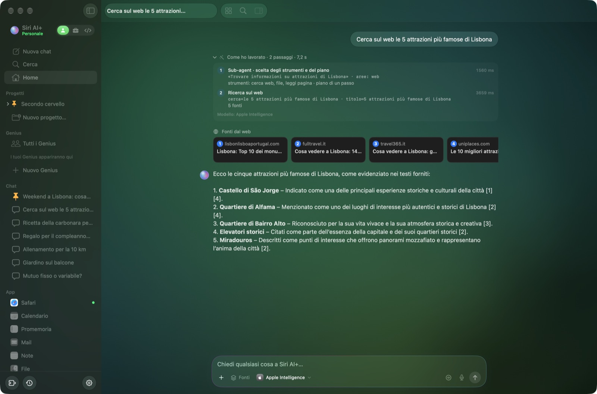<br><sub><b>Ricerca sul web</b> con le fonti numerate e il riquadro «Come ho lavorato»</sub></td>
    <td width="50%">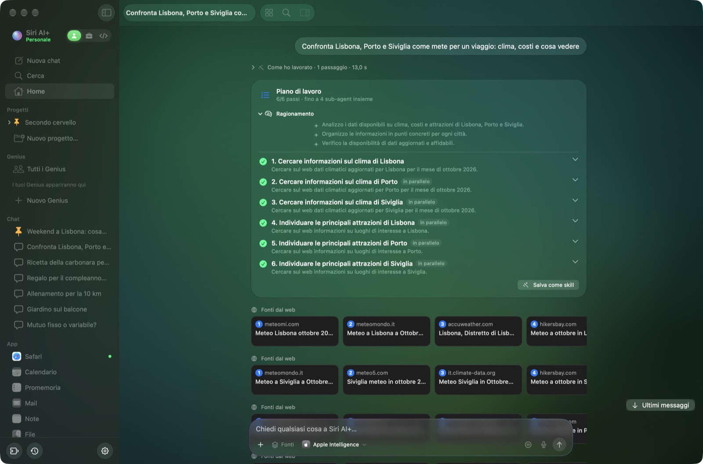<br><sub><b>Piani con i sub-agent:</b> i compiti complessi divisi in passi che lavorano in parallelo</sub></td>
  </tr>
  <tr>
    <td>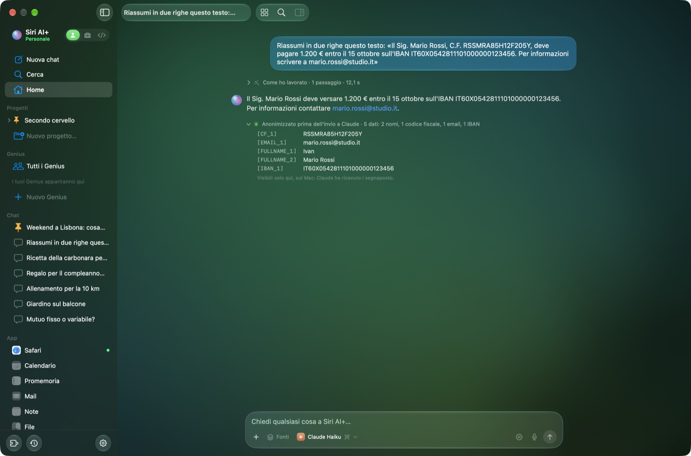<br><sub><b>Scudo per la privacy:</b> a Claude arrivano solo i segnaposto, tu leggi i dati veri</sub></td>
    <td>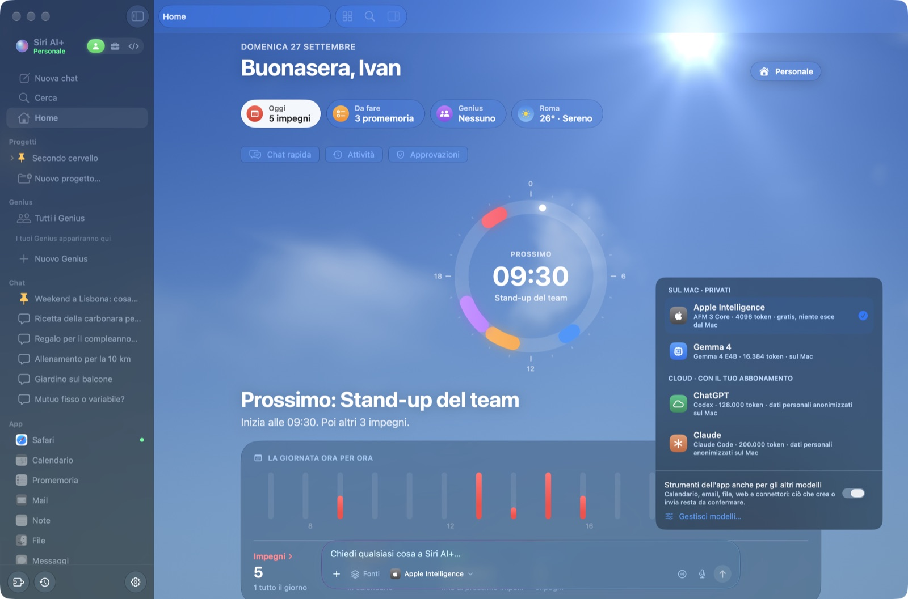<br><sub><b>Scegli il modello</b> per ogni chat, sul Mac o nel cloud</sub></td>
  </tr>
  <tr>
    <td>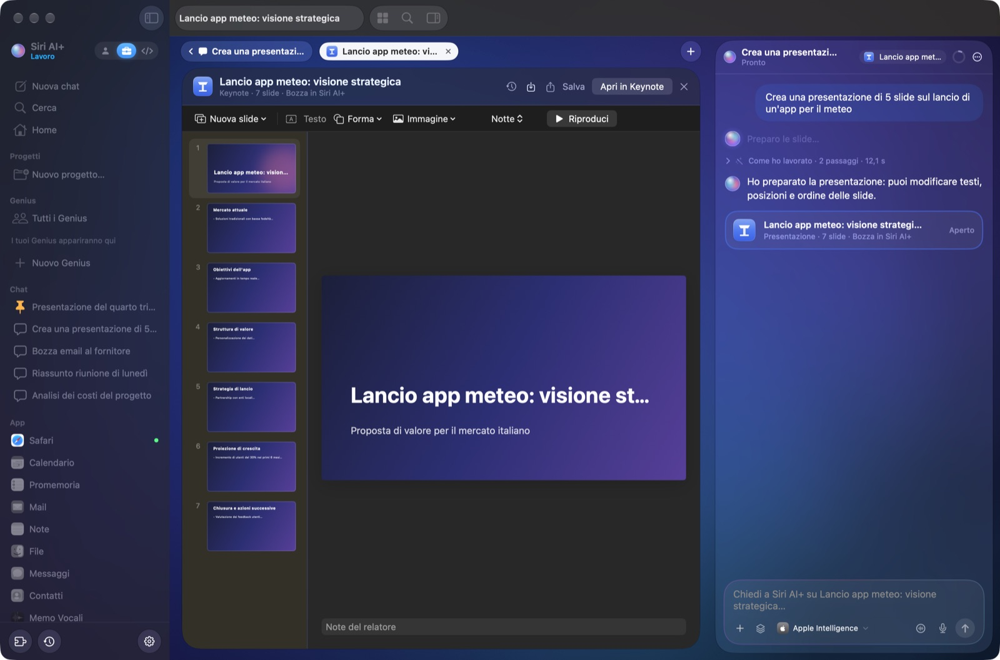<br><sub><b>Presentazioni</b> scritte da Apple Intelligence, pronte da modificare</sub></td>
    <td>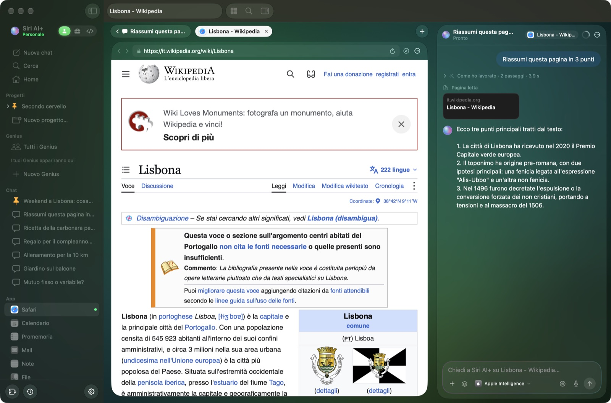<br><sub><b>App in schede:</b> Safari accanto alla chat, che legge la pagina per te</sub></td>
  </tr>
  <tr>
    <td>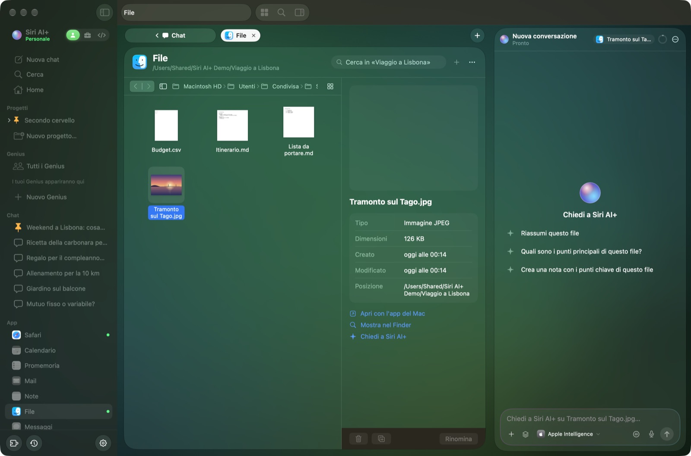<br><sub><b>File</b> con le anteprime, e la chat sa cosa hai selezionato</sub></td>
    <td>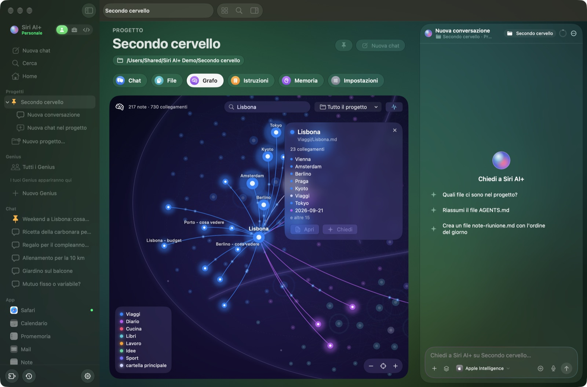<br><sub><b>Progetti:</b> le tue note come un cervello, in stile Obsidian</sub></td>
  </tr>
  <tr>
    <td>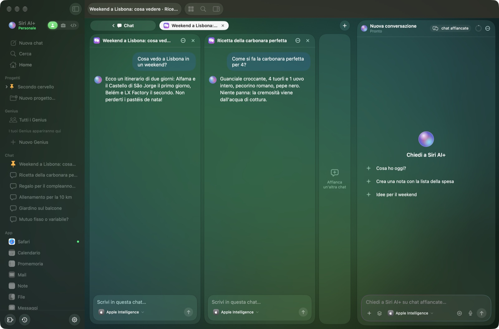<br><sub><b>Chat affiancate</b>, ognuna con il suo modello</sub></td>
    <td><br><sub><b>Genius</b> che lavorano agli orari che scegli, tengono la cronologia e chiedono prima di agire</sub></td>
  </tr>
  <tr>
    <td>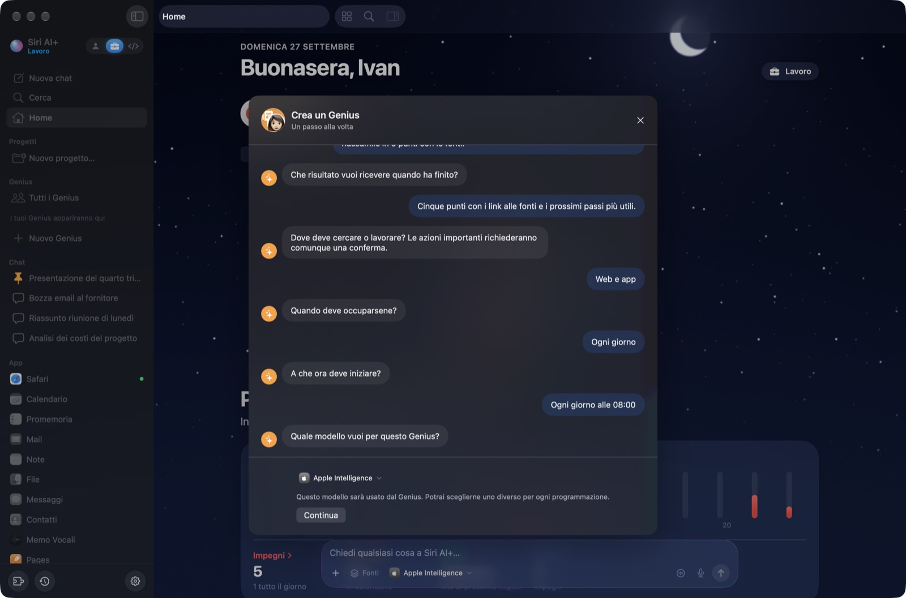<br><sub><b>Crea un Genius in chat:</b> compito, risultato, accessi, orari e modello, un passo alla volta</sub></td>
    <td><br><sub><b>Programmazioni:</b> ognuna può usare il suo modello</sub></td>
  </tr>
  <tr>
    <td colspan="2"><br><sub><b>Sei idee di Genius</b>, ognuna con il suo Genmoji Apple creato in Image Playground</sub></td>
  </tr>
  <tr>
    <td>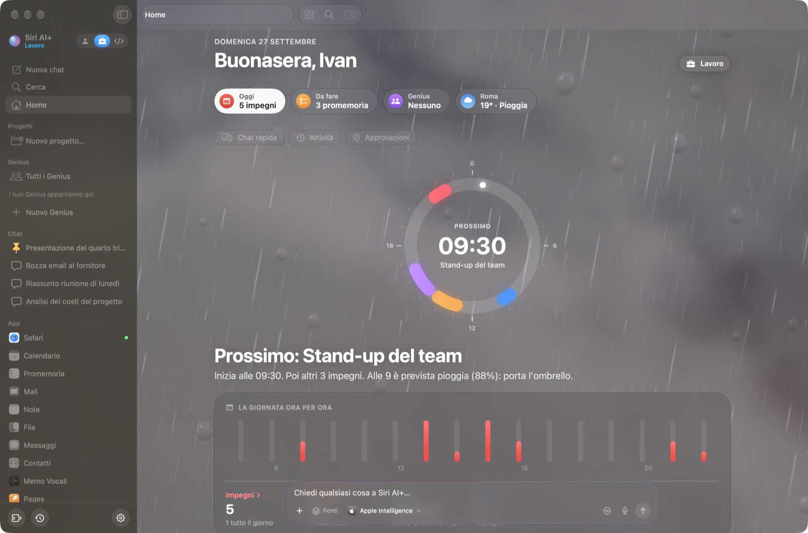<br><sub><b>Spazi:</b> Personale, Lavoro e Programmazione, ognuno con il suo stile (qui Lavoro, sotto la pioggia)</sub></td>
    <td>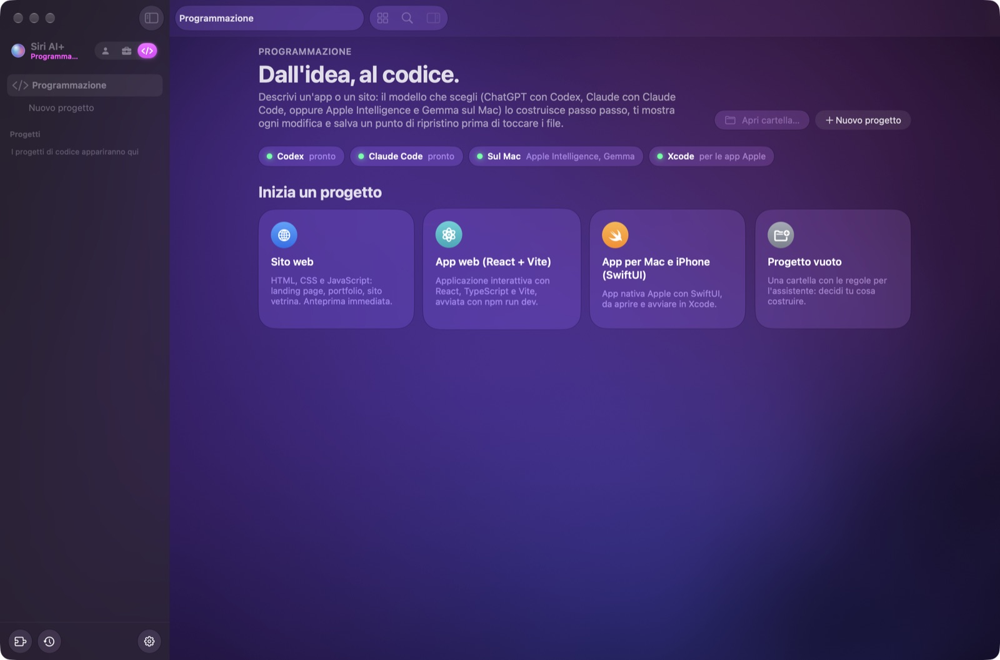<br><sub><b>Programmazione:</b> siti, app web e app SwiftUI con Xcode</sub></td>
  </tr>
</table>

<sub>Le schermate usano un profilo dimostrativo: chat, note, file e impegni sono tutti inventati. La [sezione inglese](#-english) mostra le stesse schermate in inglese.</sub>

### I modelli

| Modello | Dove gira | Privacy | Note |
|---|---|---|---|
| **Apple Intelligence** | Sul tuo Mac | 🔒 Niente esce dal Mac | Quello predefinito, gratis. Modello piccolo (circa 4.000 token di contesto sul mio M2 Pro): Siri AI+ ne spreme ogni goccia |
| **Gemma 4** | Sul tuo Mac (llama.cpp) | 🔒 Niente esce dal Mac | La versione dipende dalla memoria: E2B (qualsiasi Mac), E4B (12 GB+), 12B (16 GB+), 26B A4B (32 GB+), 31B (48 GB+) |
| **ds4** di [@antirez](https://github.com/antirez) | Sul tuo Mac | 🔒 Niente esce dal Mac | Modelli molto potenti (DeepSeek V4 Flash) su hardware di fascia alta: servono 96 GB o più di memoria unificata |
| **ChatGPT** | Cloud di OpenAI, con il tuo abbonamento (CLI Codex) | 🛡️ Dati personali anonimizzati prima | Versione e ragionamento per ogni chat |
| **Claude** | Cloud di Anthropic, con il tuo abbonamento (CLI Claude Code) | 🛡️ Dati personali anonimizzati prima | Versione e ragionamento per ogni chat |
| **Auto** ✨ | Sceglie a ogni richiesta | 🔒/🛡️ Come il modello che sceglie | Apple Intelligence per le cose semplici, Gemma per quelle private, medie o lunghe, ChatGPT (o Claude) per ragionamenti difficili e codice. Il perché di ogni scelta è in «Come ho lavorato» |

Ogni chat ricorda il suo modello. Qualunque modello risponda, gli strumenti per ogni richiesta si scelgono sul Mac e gratis: prima con rizzo-flow (qui sotto), poi con Apple Intelligence quando rizzo-flow non è sicuro.

**Gli stessi 30 compiti per ogni modello.** Per controllare che ogni modello usi lo strumento o il connettore giusto al momento giusto (e nessuno quando non serve), Siri AI+ ha un banco di prova che fa a ogni modello le stesse 30 richieste inventate: calendario, promemoria, posta, messaggi, note, file, web, due connettori finti e perfino un'email con istruzioni nascoste per l'assistente. Usa solo dati inventati (un finto «Mario Rossi»), mai il tuo calendario o la tua posta: `./bin/siriai --banco-strumenti --provider apple|gemma|chatgpt|claude|auto`. Prima e dopo le correzioni del 28 settembre 2026:

| Modello | Prima | Dopo |
|---|---|---|
| Apple Intelligence | 26/30 | 30/30 |
| Auto | 25/30 | 30/30 |
| ChatGPT (GPT-6-Luna, ragionamento basso) | 25/30 | 29/30 |
| Claude (Sonnet, ragionamento basso) | 27/30 | 29/30 |

Gemma 4 non è ancora in tabella: quel giorno il mio Mac da 16 GB non aveva la memoria per farla girare insieme ad Apple Intelligence.

### ⚡ Decisioni rapide, grazie a rizzo-flow

Quasi tutto quello che un assistente decide prima di rispondere è una domanda chiusa: in quale app guardo? Quale azione faccio? Quale modello uso? Questo file ha dati personali? Vale la pena ricordarlo? Prima Siri AI+ lo chiedeva a un piccolo modello generativo, una domanda alla volta. Ora lo chiede a [rizzo-flow](https://github.com/rizzo-ai-academy/rizzo-flow), il *System One* open source di Simone Rizzo ([@simone-rizzo](https://github.com/simone-rizzo)) e della Rizzo AI Academy: un modello locale che non scrive una parola, legge solo la probabilità di ogni risposta. Ci mette pochi decimi di secondo, e quando non è sicuro Siri AI+ decide come prima.

- **Risposte più veloci.** Sceglie da solo area e azione, così il pianificatore di Apple Intelligence si salta quando non c'è niente da riempire. Sui miei banchi di prova il tempo mediano è sceso da 3,9 a 2,4 s per la pianificazione, da 6,8 a 4,4 s per le domande di tutti i giorni e da 8,5 a 6,5 s per i connettori, con gli stessi punteggi.
- **Modello Auto.** Due domande chiuse (quanto è difficile, quanto è privata) scelgono il modello a ogni richiesta.
- **Una memoria che ragiona.** Salva solo i fatti che durano (niente più falsi allarmi su «mi piace questa risposta»), riconosce i doppioni e aggiorna i ricordi vecchi. Vedi «Ricordato: …» con Annulla.
- **Anonimizzazione solo dove serve.** Sui testi lunghi distingue codice e manuali dai documenti con delle persone dentro, e salta rizzo-pii solo quando è sicuro (email, telefoni, IBAN e nomi già nascosti restano nascosti comunque).
- **Facoltativo.** Si scarica a parte (2,6 GB, Impostazioni › Modelli), gira con llama.cpp sul Mac e libera la memoria dopo 15 minuti senza richieste.

#### 🙏 Una nota su ds4

Confessione: purtroppo non ho un computer abbastanza potente, quindi [ds4](https://github.com/antirez/ds4) non l'ho mai potuto provare dentro Siri AI+. Se qualcuno lo prova, mi fa sapere com'è andata? Basta aprire una issue. Magari te, Salvatore ([@antirez](https://github.com/antirez))… *famme sape'!* 😄

### 🛡️ Lo scudo per la privacy, grazie a rizzo-pii

Claude e ChatGPT sono potentissimi, ma il testo finisce sui server di qualcun altro, quindi la privacy non è sicura. Apple non approverebbe mai 😅. Per questo Siri AI+ ha uno scudo per la privacy. È basato su [rizzo-pii](https://github.com/Rizzo-AI-Academy/rizzo-pii), l'anonimizzatore open source di Simone Rizzo ([@simone-rizzo](https://github.com/simone-rizzo)) e della Rizzo AI Academy.

Ogni volta che trova un dato personale, il Mac lo sostituisce con un segnaposto prima che il testo parta verso Claude o ChatGPT. Quando arriva la risposta, rimette i dati veri. Una prova vera:

```text
Scrivi:           Scrivi a Mario Rossi (mario.rossi@studio.it) che la fattura da 1.200 € scade il 15 ottobre, IBAN IT60X0542811101000000123456
Parte:            Scrivi a [FULLNAME_1] ([EMAIL_1]) che la fattura da 1.200 € scade il 15 ottobre, IBAN [IBAN_1]
Leggi:            la risposta, con nome, email e IBAN veri rimessi al loro posto sul Mac
```

- **Nascosti:** nomi, email, telefoni, codici fiscali, partite IVA, documenti, IBAN, carte, indirizzi di casa, targhe, dati catastali e indirizzi IP pubblici.
- **Restano leggibili:** importi, date, orari, città, aziende e siti. Senza, l'AI non riuscirebbe a lavorare bene. Puoi nascondere anche questi dalle Impostazioni.
- **Vale per tutto:** i tuoi messaggi, la cronologia, la memoria, le istruzioni dei progetti, i file, le email e i risultati degli strumenti.
- **Il dizionario resta sul Mac.** Se l'anonimizzatore non è installato o non riesce, **non parte niente** e risponde Apple Intelligence.
- **Gira sul Mac con Core ML.** Il modello di rizzo-pii è convertito in Core ML e le sue regole sono riscritte in Swift, con gli stessi risultati dell'originale. Ci mette circa 40 ms ogni 120 parole.
- **Non ancora coperto:** lo spazio di programmazione, dove Codex e Claude Code leggono direttamente i file del progetto.

### 🇪🇺 Perché l'Europa, e perché conta

A giugno 2026 Apple ha annunciato che [la nuova Siri AI non arriverà nell'UE su iPhone, iPad e Apple Watch](https://www.apple.com/newsroom/2026/06/due-to-dma-siri-ai-delayed-in-eu-for-ios-27-and-ipados-27/) a causa del **Digital Markets Act (DMA)**.

- **Cosa chiede il DMA:** Apple è un «gatekeeper», quindi deve aprire la sua piattaforma agli altri servizi.
- **Come lo legge Apple:** dovrebbe dare a qualsiasi assistente di terze parti lo stesso accesso profondo a messaggi, dati e app che ha Siri AI, e per Apple questo è un rischio per privacy e sicurezza.
- **La proposta di Apple:** uno strato intermedio, un «Trusted System Agent». La Commissione europea ha detto no e [ha risposto](https://www.euronews.com/next/2026/06/11/the-eus-dma-fines-delayed-features-and-unclear-benefits) che nel DMA non c'è assolutamente nulla che impedisca ad Apple di lanciare nuovi prodotti nell'UE.
- **Il risultato:** nessuna data per iPhone e iPad. Sul Mac, invece, Siri AI è disponibile anche nell'UE.

Le app come questa ricevono il modello piccolo di Apple che gira sul Mac. Il modello più grande, su Private Cloud Compute, richiede un'autorizzazione gestita da Apple. Il modello sul Mac resta la scelta iniziale; se Apple concede l'accesso, puoi attivare PCC dalle Impostazioni, secondo disponibilità e quota.

Il mio parere: Siri AI+ è aperta agli altri modelli, locali e cloud. I dati personali però vengono anonimizzati sul Mac prima di partire, e niente succede senza la tua conferma. Forse è proprio così che apertura e privacy possono convivere, e che Apple potrebbe entrare in Europa senza alcun problema. Apple, chiamami 😄

### ⬇️ Scaricare e installare

**Requisiti:**
- un Mac con Apple silicon;
- **macOS 27**;
- Apple Intelligence attiva (Impostazioni di Sistema › Apple Intelligence e Siri).

**Opzione 1: l'app pronta**

1. Scarica `Siri-AI-Plus-macOS.zip` dall'[ultima release](https://github.com/ivanmosetti07/siri-ai-plus/releases/latest).
2. Decomprimilo e trascina **Siri AI+** in **Applicazioni**.
3. L'app non è autenticata da Apple, perché serve un account sviluppatore a pagamento, quindi la prima volta macOS la blocca. Apri **Impostazioni di Sistema › Privacy e sicurezza**, scorri in basso e fai clic su **Apri comunque**. Oppure dal Terminale:

   ```bash
   xattr -dr com.apple.quarantine "/Applications/Siri AI+.app"
   ```

**Aggiornamenti.** Dalla versione 2.1 Siri AI+ ti avvisa quando esce una release nuova: fai clic sull'icona di download in fondo alla barra laterale e installa la nuova versione, poi si riavvia. Accetta solo un'app firmata come quella che hai, e macOS può chiedere la password se l'app è in Applicazioni. Dalla 2.0 scarica a mano la nuova release una volta.

**Opzione 2: compilala tu** (serve Xcode 27)

```bash
git clone https://github.com/ivanmosetti07/siri-ai-plus.git
cd siri-ai-plus
./build.sh
cp -R "Siri AI+.app" /Applications/
```

`build.sh` preferisce un certificato Apple con Team ID, necessario perché macOS esegua le azioni in Comandi Rapidi. Se non è disponibile usa un altro certificato di firma, oppure una firma ad hoc come ultima scelta. Senza una firma stabile macOS può richiedere di nuovo i permessi dopo una compilazione; senza Team ID le azioni possono comparire in Comandi Rapidi ma fallire quando vengono eseguite.

### 🚀 Come si usa

1. **Primo avvio.** Scegli quali fonti può usare Siri AI+ (Calendario, Promemoria, Mail, Note…) e se può solo leggerle o anche modificarle. macOS chiede ogni permesso una volta sola. Messaggi e Memo Vocali richiedono l'Accesso completo al disco, e con quello anche Mail diventa molto più veloce.
2. **Chiedi e basta**, in italiano o in inglese:
   - «Cosa ho domani?»
   - «Ricordami di chiamare il commercialista venerdì»
   - «Rispondi a Mario che giovedì va bene»
   - «Crea una presentazione sul lancio del prodotto»
   - «Cerca sul web le ultime notizie su Apple»
3. **Conferma.** Tutto ciò che scrive, invia o cancella arriva come una scheda, e decidi tu.
4. **Scorciatoie:**

   | Scorciatoia | Azione |
   |---|---|
   | ⌘N | Nuova chat |
   | ⌘K | Cerca |
   | ⌥⌘K | Chat rapida da qualunque app |
   | ⌥⌘A | App in schede |
   | ⌥⌘N | Chat affiancate |
   | ⇧⌘N | Chat figlia |
   | ⌥⌘V | Modalità vocale |
   | ⌥⌘S | Mostra o nasconde la chat laterale |

5. **Spazi.** Passa tra Personale, Lavoro e Programmazione accanto al nome, nella barra laterale. Ogni spazio ha le sue chat, i suoi progetti, i suoi Genius e calendari, e il suo modello.
6. **Cambia modello** dal pannello dei modelli nel campo di scrittura. Ogni chat tiene il suo modello, la versione e il livello di ragionamento.

L'app nativa Xcode rende disponibili in **Comandi Rapidi** le azioni «Apri Siri AI+» e «Chiedi a Siri AI+». Su macOS puoi aggiungerle a un tuo comando, ma l'app non installa un App Shortcut preconfigurato. In Impostazioni puoi scegliere l'avvio all'accesso. Chiudere la finestra lascia attivi il companion e i Genius programmati; **Esci** li ferma.

**Extra facoltativi**, in Impostazioni › Modelli:

- **Gemma 4:** installa llama.cpp con Homebrew e scarica la versione consigliata per il tuo Mac.
- **ds4:** sui Mac con 96 GB o più, scarica e compila [antirez/ds4](https://github.com/antirez/ds4), poi scarica il modello.
- **ChatGPT e Claude:** installano le CLI ufficiali Codex e Claude Code, poi fai il login con il tuo abbonamento nel browser.
- **Lo scudo per la privacy**, che serve per ChatGPT e Claude. Si lancia una volta dalla cartella del repository. Servono [pipx](https://pipx.pypa.io) (`brew install pipx`) e Xcode:

  ```bash
  Support/rizzo-pii/install.sh
  ```

Per chi sviluppa c'è la guida tecnica: [docs/GUIDA-TECNICA.md](docs/GUIDA-TECNICA.md). Spiega l'architettura, i banchi di prova, le opzioni di diagnostica, le traduzioni e gli aggiornamenti. Per i test: `./test.sh`.

### 🐛 Bug noti

L'ho fatto una domenica e qualche sera, per hobby, quindi ci sono alcuni bug. Quelli che conosco:

- Il modello piccolo di Apple ogni tanto inciampa sugli indovinelli e sui testi molto lunghi. L'harness aiuta tanto, ma resta un modello da 3 miliardi di parametri.
- La release non è autenticata da Apple, quindi macOS si lamenta la prima volta.
- Lo scudo per la privacy non copre lo spazio di programmazione.
- ds4 non è mai stato provato (vedi sopra 🙏).

Hai trovato qualcosa? Apri una [issue](https://github.com/ivanmosetti07/siri-ai-plus/issues). Le pull request sono benvenute.

### ⭐ Supporta il progetto

- ⭐ **Metti una stella** al repository con il pulsante in alto a destra. È gratis, mi motiva e aiuta altre persone a trovare Siri AI+.
- 💙 **[Sostienimi su PayPal](https://www.paypal.com/cgi-bin/webscr?cmd=_donations&business=ivanmosetti%40gmail.com&item_name=Support%20Siri%20AI%2B%20and%20future%20open-source%20apps&currency_code=EUR)** per aiutarmi a realizzare altre app open source.
- 👀 **Watch › Custom › Releases** per ricevere un avviso quando esce una nuova versione.
- 🐛 **Hai trovato un bug?** [Apri una issue](https://github.com/ivanmosetti07/siri-ai-plus/issues/new).
- 💡 **Hai un'idea o una domanda?** Scrivila nelle [Discussions](https://github.com/ivanmosetti07/siri-ai-plus/discussions).
- 🍴 **Fai un fork** e sperimenta, per usi non commerciali (vedi la licenza). Le pull request sono benvenute, anche per aggiungere nuove lingue!
- 📣 **Condividilo** su [X](https://twitter.com/intent/tweet?text=Siri%20AI%2B%3A%20il%20Siri%20AI%20che%20Apple%20avrebbe%20dovuto%20lanciare%20%F0%9F%8D%8E&url=https%3A%2F%2Fgithub.com%2Fivanmosetti07%2Fsiri-ai-plus) o su [LinkedIn](https://www.linkedin.com/sharing/share-offsite/?url=https%3A%2F%2Fgithub.com%2Fivanmosetti07%2Fsiri-ai-plus).
- 👤 **Seguimi** su GitHub: [@ivanmosetti07](https://github.com/ivanmosetti07).

### 📜 Licenza

La licenza è [PolyForm Noncommercial 1.0.0](LICENSE.md). Puoi usare, studiare, modificare e condividere Siri AI+ gratis, per qualsiasi scopo **non commerciale**: uso personale, studio, ricerca, hobby, scuole, associazioni no profit. **Non** puoi venderlo né usarlo per guadagnarci. Per questo è *source available* e non «open source» nel senso dell'OSI. Per usi commerciali, scrivimi.

Crediti e licenze dei componenti di terzi sono in [THIRD_PARTY_NOTICES.md](THIRD_PARTY_NOTICES.md).

### ❤️ Grazie

- Ad Apple, per il framework Foundation Models.
- A Salvatore Sanfilippo ([@antirez](https://github.com/antirez)), per [ds4](https://github.com/antirez/ds4).
- A Simone Rizzo ([@simone-rizzo](https://github.com/simone-rizzo)) e alla Rizzo AI Academy, per [rizzo-pii](https://github.com/Rizzo-AI-Academy/rizzo-pii) e [rizzo-flow](https://github.com/rizzo-ai-academy/rizzo-flow).
- A Google, per [Gemma](https://ai.google.dev/gemma), e a [ggml-org](https://github.com/ggml-org/llama.cpp), per llama.cpp.
- A [Open-Meteo](https://open-meteo.com), per i dati del meteo.
- A OpenAI Codex e Anthropic Claude Code, che fanno lavorare il tuo abbonamento.

---

## ⭐ Star history

<a href="https://star-history.com/#ivanmosetti07/siri-ai-plus&Date">
  
</a>

<p align="center"><sub>Made with ❤️, Apple Intelligence and too much coffee ☕ · Fatto con ❤️, Apple Intelligence e troppo caffè ☕</sub></p>
